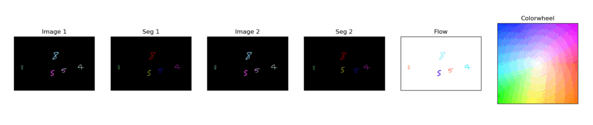

# Flying MNIST: A Toy Dataset for Video Instance/Object Segmentation and Optical Flow+



## Overview

The Flying MNIST dataset is a specialized resource crafted for video instance segmentation tasks. It leverages the classic MNIST dataset, transforming static digit images into dynamic sequences that mimic real-world videos. This dataset is ideal for researchers and practitioners in computer vision and deep learning seeking to advance video instance segmentation using optical flow information.

## Key Features

* Dynamic Digit Sequences: Flying MNIST contains sequences of MNIST digits in motion, simulating the dynamics of objects in video frames.
* Optical Flow Data: Each sequence is paired with optical flow information, providing essential motion cues for accurate instance segmentation.
* Variety of Scenarios: The dataset covers various scenarios, including digit interactions, occlusions, and complex trajectories.
* Annotated Masks: Ground truth pixel-wise instance segmentation masks are included for evaluation and benchmarking purposes.

## Creating the Dataset

To generate the dataset, run: 

```
python main.py
```

By default, the script creates a folder "trn". Inside, the dataset has the following structure.

* JPEGImages/: Contains the video frames in JPEG format, where each frame corresponds to a time step in a sequence.
* OpticalFlow/: Optical flow data in dense optical flow format (e.g., .flo files) corresponding to the frames.
* Annotations/: Ground truth instance segmentation masks in PNG format.

    
You can inspect the parameters inside the script to control the speed, number of digits, trajectories etc.

## Visualization

To visualize the dataset, you can use player.py. To make that script run, please create a folder called "out".

```
python player.py
```
